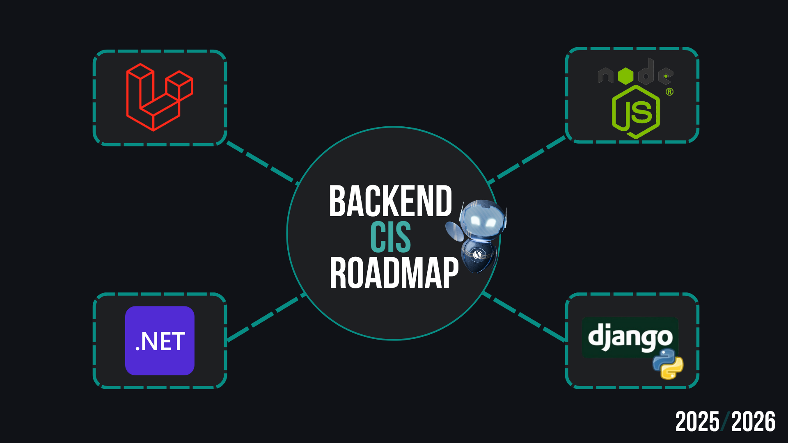

# Back-End Circle Roadmap

This repository contains a collection of backend development roadmaps for different technologies.
Each roadmap is organized in its own folder.

---

## 🚀 Available Roadmaps

Click on any roadmap to open it:

- [.NET Roadmap](https://github.com/CIS-Team/2025-2026-Roadmaps/tree/main/Backend/.NET)
- [Node.js Roadmap](https://github.com/CIS-Team/2025-2026-Roadmaps/tree/main/Backend/NodeJS)
- [Laravel Roadmap](https://github.com/CIS-Team/2025-2026-Roadmaps/tree/main/Backend/Laravel)
- [Django Roadmap](https://github.com/CIS-Team/2025-2026-Roadmaps/tree/main/Backend/Django)

---

This repository will be **updated regularly** with new lessons, tasks, and refined structure.

Stay tuned! 🌟
