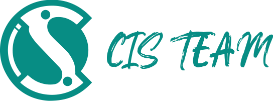

# **2025–2026 Roadmaps**  
🚀 **Your go-to resource for clear, structured, and up-to-date roadmaps for the most important technical tracks!**  

This repository contains **detailed, step-by-step roadmaps** designed to help you navigate your learning journey from **beginner → advanced**.  
Each roadmap covers the **core concepts, tools, technologies, resources, and project ideas** you need to excel in your chosen field.

---

## **📂 Included Tracks**

1. [**AI & Data Science**](https://github.com/CIS-Team/2025-2026-Roadmaps/tree/main/AI%20%26%20Data%20Science)  
2. [**Backend**](https://github.com/CIS-Team/2025-2026-Roadmaps/tree/main/Backend)  
3. [**Business Analysis**](https://github.com/CIS-Team/2025-2026-Roadmaps/tree/main/Business%20Analysis)  
4. [**Computer Science**](https://github.com/CIS-Team/2025-2026-Roadmaps/tree/main/Computer%20Science)  
5. [**Cyber Security**](https://github.com/CIS-Team/2025-2026-Roadmaps/tree/main/Cyber%20Security)  
6. [**Flutter**](https://github.com/CIS-Team/2025-2026-Roadmaps/tree/main/Flutter)  
7. [**Frontend**](https://github.com/CIS-Team/2025-2026-Roadmaps/tree/main/Frontend)  
8. [**UI/UX**](https://github.com/CIS-Team/2025-2026-Roadmaps/tree/main/UI%20-%20UX)  
9. [**Video Editing**](https://github.com/CIS-Team/2025-2026-Roadmaps/tree/main/Video%20Editing)  

Each track includes:  
- ✔️ Full roadmap  
- ✔️ Skills and competencies  
- ✔️ Tools & technologies  
- ✔️ Recommended resources  
- ✔️ Practice tasks and project ideas  

---

## **✨ Features**
- 📘 Trusted recommended resources (books, videos, platforms)  
- 🛠️ Essential tools and technologies for each specialization  
- 🎯 Tips on building practical projects and portfolios  
- 🌐 Insights into real industry practices  
- 🔄 Updated and relevant to **2025–2026** skill demands  

Whether you're a beginner, a student, or shifting careers, these roadmaps provide a clear direction to help you level up in your chosen field.

---

💻 **Start your journey today and level up your tech skills!**

  

