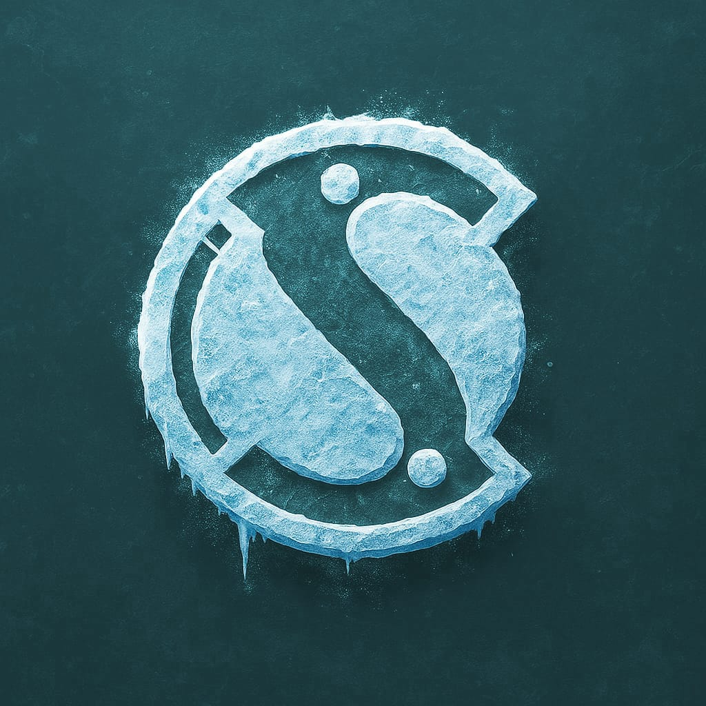

<table align="center">
<tr>

<td>

</td>

<td>

<h1>CIS Team Roadmaps 2025–2026</h1>

<p>Your complete learning guide for today's most in-demand tech careers.</p>

</td>

</tr>
</table>

<p align="center">
Structured roadmaps, curated learning resources, practical projects, and career guidance designed for students and self-learners.
</p>

<p align="center">
  <a href="#-available-learning-paths">Explore Roadmaps</a>
  •
  <a href="#-contributing">Contribute</a>
</p>

<p align="center">


</p>

---

> [!NOTE]
> These roadmaps are continuously maintained and updated to reflect the latest industry standards, tools, and best practices for **2025–2026**.

---

# 📖 About

The **CIS Team Roadmaps 2025–2026** repository is a curated collection of structured learning paths covering the most in-demand technical specializations.

Each roadmap is carefully designed to guide learners from **Beginner → Intermediate → Advanced**, helping them build strong technical foundations, gain practical experience, and become industry-ready.

Whether you're a university student, self-learner, or career shifter, these roadmaps provide a clear learning journey to help you reach your goals.

---

# 🚀 Quick Start

Getting started is simple:

1. 📂 Choose your preferred roadmap.
2. 📚 Learn each topic in order.
3. 🛠 Practice using the recommended resources.
4. 🚀 Build the suggested projects.
5. 💼 Create your portfolio.
6. 🌟 Continue learning and improving.

---

# 🏆 What Makes These Roadmaps Different?

Unlike random collections of resources, every roadmap is:

- 🎯 Carefully structured
- 📚 Resource-focused
- 🛠 Practice-oriented
- 💼 Portfolio-driven
- 🌍 Industry aligned
- 🚀 Continuously updated

---

# 📊 Repository Overview

| 📚 Tracks | 📖 Learning Paths | 🛠 Resources | 🚀 Projects |
|-----------|------------------|-------------|------------|
| **12** | Beginner → Advanced | Carefully Curated | Included |

---

# 📑 Table of Contents

- [🧭 Available Learning Paths](#-available-learning-paths)
- [✨ What You'll Find](#-what-youll-find)
- [🛤 Learning Journey](#-learning-journey)
- [🎯 Who Is This For?](#-who-is-this-for)
- [🌟 Why These Roadmaps?](#-why-these-roadmaps)
- [🤝 Contributing](#-contributing)
- [🌍 Connect with CIS Team](#-connect-with-cis-team)

---

# 🧭 Available Learning Paths

| Field | Description | Roadmap |
|------|-------------|----------|
| 🤖 **AI & Data Science** | Machine Learning, Deep Learning, Data Analysis | [Open Roadmap](https://github.com/CIS-Team/2025-2026-Roadmaps/tree/main/AI%20%26%20Data%20Science) |
| ⚙️ **Backend** | APIs, Databases, Frameworks, System Design | [Open Roadmap](https://github.com/CIS-Team/2025-2026-Roadmaps/tree/main/Backend) |
| 📊 **Business Analysis** | Requirements Engineering, UML, Agile, Documentation | [Open Roadmap](https://github.com/CIS-Team/2025-2026-Roadmaps/tree/main/Business%20Analysis) |
| 💻 **Computer Science** | Programming, Data Structures, Algorithms, OS, Networks | [Open Roadmap](https://github.com/CIS-Team/2025-2026-Roadmaps/tree/main/Computer%20Science) |
| 🔐 **Cyber Security** | Networking, Pentesting, Web Security, SOC, Malware Analysis | [Open Roadmap](https://github.com/CIS-Team/2025-2026-Roadmaps/tree/main/Cyber%20Security) |
| 📱 **Flutter** | Cross-platform Mobile Development | [Open Roadmap](https://github.com/CIS-Team/2025-2026-Roadmaps/tree/main/Flutter) |
| 🌐 **Frontend** | HTML, CSS, JavaScript, React, Vue | [Open Roadmap](https://github.com/CIS-Team/2025-2026-Roadmaps/tree/main/Frontend) |
| 🎨 **UI / UX** | UX Research, Figma, Design Systems | [Open Roadmap](https://github.com/CIS-Team/2025-2026-Roadmaps/tree/main/UI%20-%20UX) |
| 🎬 **Video Editing** | Premiere Pro, After Effects, Motion Graphics | [Open Roadmap](https://github.com/CIS-Team/2025-2026-Roadmaps/tree/main/Video%20Editing) |
| 🖌️ **Graphic Design** | Photoshop, Illustrator, Branding | [Open Roadmap](https://github.com/CIS-Team/2025-2026-Roadmaps/tree/main/Graphic%20Design) |
| 📣 **Marketing & Content** | Digital Marketing, Content Creation, Branding, SEO, Copywriting & Social Media | [Open Roadmap](https://github.com/CIS-Team/2025-2026-Roadmaps/tree/main/Marketing%20%26%20Content) |

<p align="right">
<a href="#-cis-team-roadmaps-20252026">⬆ Back to Top</a>
</p>

---

# ✨ What You'll Find

| Feature | Description |
|----------|-------------|
| 📚 Curated Learning Resources | Carefully selected courses, books, documentation, and articles |
| 🛠 Practical Skills | Learn through real-world practice |
| 🚀 Project-Based Learning | Hands-on projects to reinforce concepts |
| 💼 Portfolio Building | Showcase your work professionally |
| 🎯 Structured Learning | Beginner → Intermediate → Advanced |
| 🌍 Career Guidance | Internship and job preparation |
| 💡 Industry Best Practices | Learn modern workflows and tools |
| 🔄 Updated Content | Continuously maintained for 2025–2026 |

---

> [!TIP]
> Complete each roadmap in order. Building a strong foundation first will make advanced concepts much easier.
---

# 🛤 Learning Journey

```text
           🎯 Choose a Track
                  │
                  ▼
        📚 Learn the Fundamentals
                  │
                  ▼
       🛠 Practice What You Learn
                  │
                  ▼
       🚀 Build Real-world Projects
                  │
                  ▼
        💼 Create Your Portfolio
                  │
                  ▼
     🌟 Prepare for Internships & Jobs
```

<p align="right">
<a href="#-cis-team-roadmaps-20252026">⬆ Back to Top</a>
</p>

---

# 🎯 Who Is This For?

These roadmaps are designed for:

- 🎓 University students
- 💻 Self-learners
- 🌱 Beginners starting their tech journey
- 🔄 Career shifters
- 🚀 Developers looking to level up their skills
- 🌍 Anyone passionate about technology

---

# 🌟 Why These Roadmaps?

These learning paths are carefully crafted to provide a practical and structured learning experience.

- ✅ Beginner-friendly progression
- ✅ Structured learning journey
- ✅ Carefully curated resources
- ✅ Industry-oriented technologies
- ✅ Hands-on practice
- ✅ Real-world project ideas
- ✅ Portfolio-focused learning
- ✅ Internship & career preparation
- ✅ Updated for **2025–2026**

<p align="right">
<a href="#-cis-team-roadmaps-20252026">⬆ Back to Top</a>
</p>

---

# 🤝 Contributing

Learning is better when we build together.

We welcome contributions from students, professionals, and anyone passionate about education.

You can contribute by:

- 🐞 Reporting issues
- 📚 Suggesting new learning resources
- ✨ Improving existing roadmaps
- 🚀 Submitting Pull Requests
- 💬 Sharing ideas and feedback

Every contribution helps make these roadmaps even more valuable for the community.

---

# 📜 Repository Structure

```text
2025-2026-Roadmaps/
│
├── AI & Data Science/
│   └── AI-&-Data-Science-roadmap.md
│
├── Backend/
│   ├── .NET
│        └── README.md
│   ├── Django
│        └── README.md
│   ├── Laravel
│        └── README.md
│   ├── Node.JS
│        └── README.md
│   ├── backendCIS.png
│   └── README.md
│
├── Business Analysis/
│   └── Business-Analysis-roadmap.md
│
├── Computer Science/
│   └── Computer-Science-roadmap.md
│
├── Cyber Security/
│   ├── Malware Roadmap.md
│   └── Pentest Roadmap.md
│
├── Flutter/
│   └── Flutter-roadmap.md
│
├── Frontend/
│   ├── README.md
│   ├── React.md
│   └── Vue.md
│
├── Graphic Design/
│   └── CIS Graphic Design Roadmap 2026.pdf
│
├── Marketing/
│   ├── Marketing/
│        └── Marketing Roadmap.docx
│   └── Content/
│        └── Content Roadmap.docx
│
├── UI - UX/
│   └── UI-UX-roadmap.md
│
├── Video Editing/
│   └── video-editing-roadmap.md
│
├── assets/
│   ├── logo.jpg
│   └── slogan.png
│
└── README.md
```

---

# 🌍 Connect with CIS Team

Stay connected with the CIS Team and join our community.

- 🌐 **Website:** https://cisteam.org
- 💻 **GitHub:** https://github.com/CIS-Team
- 💬 **Discord:** https://discord.gg/gNyZGDnvna
- 💼 **LinkedIn:** https://linkedin.com/company/cisteam15
- 📘 **Facebook:** https://facebook.com/cisteam15
- 📸 **Instagram:** https://instagram.com/cisteam15

---

# ❤️ Support the Project

If these roadmaps helped you in your learning journey, consider supporting the project by:

- ⭐ Starring this repository
- 🍴 Forking it
- 📢 Sharing it with your friends
- 🤝 Contributing to improve it

Every star motivates us to create better learning resources.

---

<p align="center">
  
</p>

---

<h3 align="center">
💙 Learn • Build • Practice • Grow
</h3>

<p align="center">
Developed and maintained with ❤️ by <strong>CIS Team</strong>
</p>

<p align="center">
⭐ If you find this repository helpful, don't forget to leave a star!
</p>
